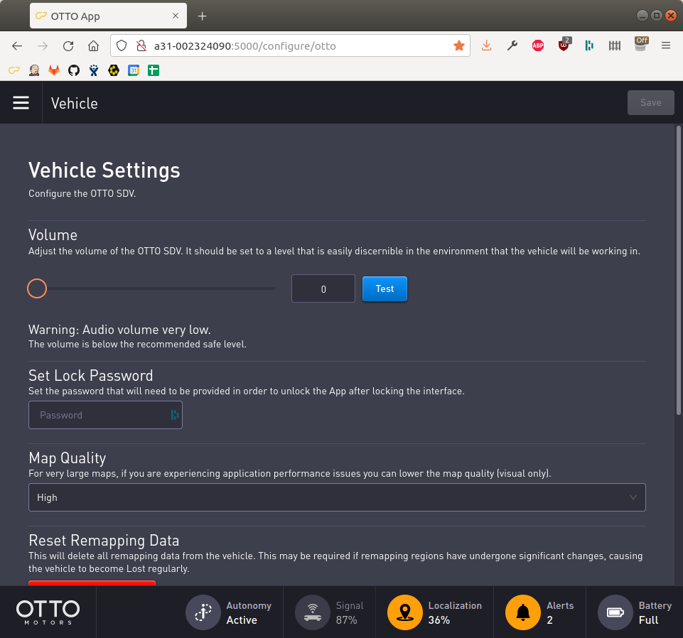
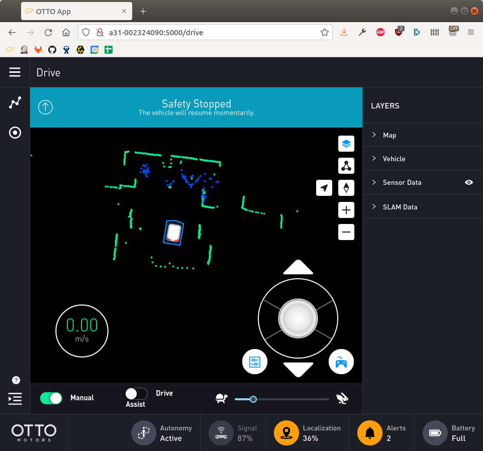

boxer_robot
============

NOTE: This branch is for the new Boxer v2.4, which is supported on Noetic onward.  Older Boxers that ran Kinetic
and earlier will not work with this branch and are not considered to have reached end-of-life.

Boxer 2.4 uses an unmodified Otto 100 base platform, running a customized version of ROS2.  For Noetic compatibility we
use the `ros1_bridge` ROS2 package, running under Foxy.  This requires that ROS1 and ROS2 both be installed on the
Boxer's backpack PC.

The ROS2 API operates on 3 domains:

| Domain ID | API      | ROS1 Bridge Node   | Topic Namespace     |
|-----------|----------|--------------------|---------------------|
| 100       | Fleet    | `fleet_bridge`     | `/cpr_fleet_api`    |
| 110       | Autonomy | `autonomy_bridge`  | `/cpr_autonomy_api` |
| 120       | Platform | `platform_bridge`  | `/cpr_platform_api` |

The `boxer_base` package contains the necessary launch files and scripts to translate the ROS2 topics into their
appropriate ROS1 names.  By default the Otto 100 publishes all topics into a namespace matching the robot's physical
serial number.  This serial number must be assigned to the `ROS_ROBOT_SERIAL_NO` environment variable inside
`/etc/ros/setup.bash`:

```bash
# set the serial number of the Otto 100 base platform
export ROS_ROBOT_SERIAL_NO=A31_0123456789
```

The `boxer_bringup` package contains the `install` script which will create 2 systemd jobs: `ros` and `ros-bridge`.

The `ros` systemd job controls the `roscore` process and starts additional ROS1 nodes needed for operating the robot.

The `ros-bridge` systemd job creates 3 `ros1_bridge` nodes, bridging the Otto 100's ROS2 platform, autonomy, and fleet
APIs onto the ROS1 network.


Base Platform Preparation
---------------------------

You must enable the ROS2 API on the base platform before you can operate the robot.  To do this, ssh into the
base platform (hostname matches the serial number).

If you are using the latest version of the Otto software, 2.22.3 at the time of writing, add the following to
`/etc/ros/setup.bash`

```bash
export ROBOT_REQUIRE_NIMBUS=False
export BRIDGE_INTF=att0
export ENABLE_PLATFORM_ADAPTOR=True
```

Older versions of the Otto software, such as 1.18.x, require additional configuration:
create the file `/var/tmp/rzr_configuration/env.sh` and put the following into it:

```bash
export ROBOT_REQUIRE_NIMBUS=False
export BRIDGE_INTF=att0
export ENABLE_PLATFORM_ADAPTOR=True
```

Then edit `/etc/ros/setup.bash` and add the following:

```bash
source /var/tmp/rzr_configuration/env.sh
```

Regardless of which API version you have installed, power-cycle the robot after making these changes.


Backpack PC Preparation
-------------------------

Install ROS2 Foxy and the `ros1_bridge` package:

```bash
sudo apt-get install ros-foxy-ros-base ros-foxy-ros1-bridge ros-foxy-rmw-cyclonedds-cpp
```

Then install the ROS2 API packages provided by Otto.  Depending on the version of the Otto software you may
need a different version.  Otto 2.22.3 uses API 1.3:

```bash
wget http://prod-vm-jfrog-01.clearpath.ai//cpr-deps/pool/focal/clearpath-api_1.3.3-0_amd64.deb
sudo dpkg -i clearpath-api_1.3.3-0_amd64.deb
```

Otto 2.18.x uses API 1.1:

```bash
wget http://prod-vm-jfrog-01.clearpath.ai//cpr-deps/pool/focal/clearpath-api_1.1.8-0_amd64.deb
sudo dpkg -i clearpath-api_1.1.8-0_amd64.deb
```

Add the appropriate API version to `/etc/ros/setup.bash`.  Select the appropriate line below to match the API
version you installed above.

```bash
# Version 1.1
export BOXER_API_VERSION=v1_1

# Version 1.2
export BOXER_API_VERSION=v1_2

# Version 1.3
export BOXER_API_VERSION=v1_3
```

If you haven't already done so (e.g. you did not use Clearpath's Universal ISO for ROS Noetic), install
ROS Noetic on the backpack computer:

```bash
sudo apt-get install ros-noetic-robot
```

Be sure to add the Clearpath apt sources according to http://packages.clearpathrobotics.com and configure rosdep.

Additional dependencies that, at the time of writing, are not installable through rosdep:

```bash
# PS4 controller driver
sudo apt-get install python-ds4drv

# Wireless monitoring ROS node and its underlying system dependency
git clone https://github.com/clearpathrobotics/wireless.git
sudo apt-get install wireless-tools
```

Finally, you may need to configure the network bridge to omit `eno1` from the bridge and instead configure it as a
static interface for communicating with the Otto 100 base platform.  Edit `/etc/netplan/50-clearpath-bridge.yaml` as
follows (or whatever the name of your netplan configuration file happens to be)

```yaml
network:
  version: 2
  renderer: networkd
  ethernets:
    # static interface for communicating with the Otto 100 base
    eno1:
      dhcp4: no
      dhcp6: no
      addresses:
        - 10.252.252.100/16

    # bridge all other wired interfaces together on 192.168.131.x
    bridge_eth:
      dhcp4: no
      dhcp6: no
      match:
        name: eth*
    bridge_enp:
      dhcp4: no
      dhcp6: no
      match:
        name: enp*
    bridge_enx:
      dhcp4: no
      dhcp6: no
      match:
        name: enx*
  bridges:
    br0:
      dhcp4: yes
      dhcp6: no
      interfaces: [bridge_enp, bridge_enx, bridge_eth]
      addresses:
        - 192.168.131.1/24
```

Ensure that `boxer_base/config/cyclone_dds.xml` has the correct interface defined in it:

```xml
<NetworkInterfaceAddress>eno1</NetworkInterfaceAddress>
```


Web Interface
---------------

Many of Boxer's features are available through the Otto web interface.  To access this, connect your computer to the
same wireless network at the base robot (or connect directly to the robot's ethernet port) and navigate to
`http://{boxer-ip-address}:5000`



This will allow you to adjust the volume of the robot's audio warnings and view the map the robot has made of its
environment.  You can also take the robot out of neutral using this interface.




Building Instructions
----------------------

After the base platform and backpack computers have been prepared, clone this package into a catkin workspace
and build it using the normal `catkin_make` command:

```bash
source /opt/ros/noetic/setup.bash
mkdir -p ~/catkin_ws/src
cd ~/catkin_ws/src
git clone http://github.com/boxer-cpr/boxer.git
git clone http://github.com/boxer-cpr/boxer_robot.git
cd ..
rosdep install --from-paths src --ignore-src -r -y --rosdistro=noetic
catkin_make
source devel/setup.bash
```

Add the following to `/etc/ros/setup.bash`

```bash
source /home/administrator/catkin_ws/devel/setup.bash
```

Finally install the Boxer bringup:

```bash
rosrun boxer_bringup install
```

Restart ROS and the bridge:

```bash
sudo systemctl restart ros
sudo systemctl restart ros-bridge
```

Verify that the bridge nodes are running, and check that a few topics from the base platform
are publishing correctly:

```bash
$ rosnode list
# a whole lot of relay nodes....
# ...
/autonomy_bridge
/bluetooth_teleop/joy_node
/bluetooth_teleop/teleop_twist_joy
/diagnostic_aggregator
/ekf_localization
/fleet_bridge
/imu_filter
/platform_bridge
/robot_state_publisher
/rosout
/state_aggregator_node
/twist_marker_server
/twist_mux
/wireless/wireless_watcher

$ rostopic hz /cpr_fleet_api/v1_1/$ROS_ROBOT_SERIAL_NO/bms/battery_status
# [...]
average rate: 1.000
	min: 1.000s max: 1.000s std dev: 0.00000s window: 1

$ rostopic hz /cpr_platform_api/v1_1/A31_002324090/laser/module0/scan
# [...]
average rate: 25.166
	min: 0.000s max: 0.159s std dev: 0.02727s window: 25
```

Finally test that the robot can move by disengaging the e-stop, taking it out of neutral, and moving it using
either the provided game controller or with the following command:

```bash
rostopic pub /cmd_vel geometry_msgs/Twist "linear:
  x: 0.1
  y: 0.0
  z: 0.0
angular:
  x: 0.0
  y: 0.0
  z: 0.0" -r 10
```

This command will make the robot drive forward at 10cm/s.  Make sure the path is clear, and cancel the command to
stop the robot, or use the e-stop.
